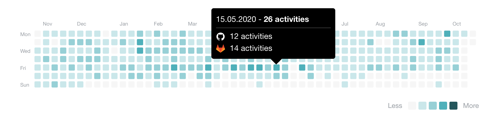

# CodersRank Activity Widget

CodersRank Activity Widget is a web component that allows you easily integrate nice looking activity chart from your [CodersRank](https://codersrank.io) profile to your personal website:



## Install from NPM

Widget script available through NPM:

```
npm i @codersrank/activity --save
```

After installation you need to import and register web component:

```js
import CodersRankActivity from '@codersrank/activity';

// register web component as <codersrank-activity> element
window.customElements.define('codersrank-activity', CodersRankActivity);
```

## Install from CDN

Widget can also be downloaded or linked directly from CDN:

```html
<!-- replace x.x.x with actual version -->
<script src="https://unpkg.com/@codersrank/activity@x.x.x/codersrank-activity.min.js"></script>
```

In this case it is not required to register web component, it is already registered to be use as `<codersrank-activity>` element.

## Usage

As it is a web component the usage is pretty simple, just add widget HTML tag with your [CodersRank](https://codersrank.io) username

```html
<codersrank-activity username="YOUR_USERNAME"></codersrank-activity>
```

## Widget Attributes

Widget supports following properties as HTML element attributes:

| Name        | Type      | Default | Description                                         |
| ----------- | --------- | ------- | --------------------------------------------------- |
| `username`  | `string`  |         | Your [CodersRank](https://codersrank.io) username   |
| `weeks`     | `number`  | `52`    | Amount of weeks to be rendered in chart (max `52`). |
| `labels`    | `boolean` | `false` | Display chart labels (months and days of the week)  |
| `legend`    | `boolean` | `false` | Display legend below the chart                      |
| `tooltip`   | `boolean` | `false` | Enables tooltip with number of activities per day   |
| `step`      | `number`  | `10`    | Number of activities for division by colors         |
| `svg-width` | `number`  | `800`   | Render width of chart's SVG element                 |

For example, to enable labels, legend and tooltip:

```html
<codersrank-activity username="YOUR_USERNAME" labels legend tooltip></codersrank-activity>
```

## Styling

It is possible to customize widget colors with CSS Custom Properties (CSS Variables) by setting them directly on the widget element with style attribute or in CSS.

There are following CSS Custom Properties are available:

| Property               | Value                                                     |
| ---------------------- | --------------------------------------------------------- |
| `--font-family`        | `Open Sans, Helvetica Neue, Helvetica, Arial, sans-serif` |
| `--label-font-size`    | `9px`                                                     |
| `--label-text-color`   | `#999ea4`                                                 |
| `--legend-font-size`   | `12px`                                                    |
| `--legend-text-color`  | `#999ea4`                                                 |
| `--legend-item-width`  | `14px`                                                    |
| `--legend-item-height` | `14px`                                                    |
| `--legend-margin`      | `1em 0 0 0`                                               |
| `--bg-color-0`         | `#f6f6f6`                                                 |
| `--bg-color-1`         | `rgba(80, 176, 186, 0.3)`                                 |
| `--bg-color-2`         | `rgba(80, 176, 186, 0.6)`                                 |
| `--bg-color-3`         | `rgba(80, 176, 186, 1)`                                   |
| `--bg-color-4`         | `#24565a`                                                 |
| `--border-color-0`     | `transparent`                                             |
| `--border-color-1`     | `transparent`                                             |
| `--border-color-2`     | `transparent`                                             |
| `--border-color-3`     | `transparent`                                             |
| `--border-color-4`     | `transparent`                                             |
| `--svg-width`          | `100%`                                                    |
| `--svg-height`         | `auto`                                                    |
| `--preloader-color`    | `#72a0a8`                                                 |
| `--tooltip-font-size`  | `14px`                                                    |

## Contribution

Yes please! See the [contributing guidelines](https://github.com/codersrank-org/activity/blob/master/CONTRIBUTING.md) for details.

## Licence

This project is licensed under the terms of the [MIT license](https://github.com/codersrank-org/activity/blob/master/LICENSE).
